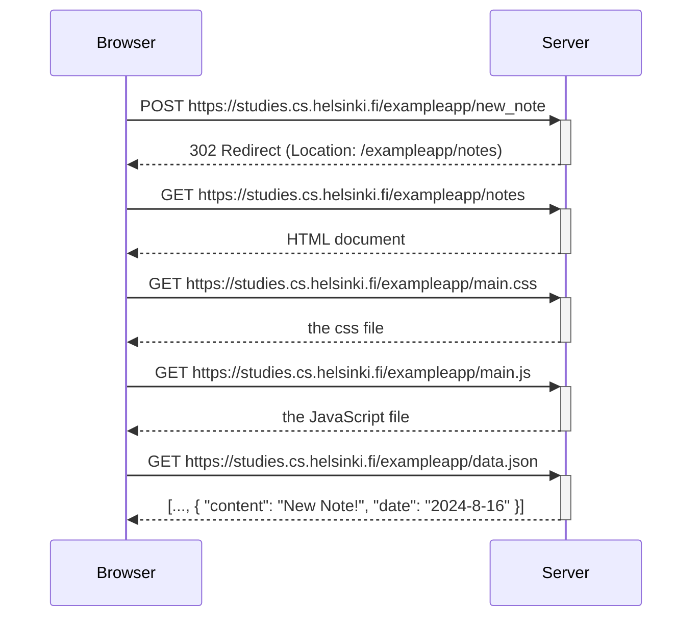

```mermaid
  sequenceDiagram
    Browser->>+Server: POST https://studies.cs.helsinki.fi/exampleapp/new_note
    Server-->>-Browser: 302 Redirect (Location: /exampleapp/notes)

    Browser->>+Server: GET https://studies.cs.helsinki.fi/exampleapp/notes
    Server-->>-Browser: HTML document

    Browser->>+Server: GET https://studies.cs.helsinki.fi/exampleapp/main.css
    Server-->>-Browser: the css file

    Browser->>+Server: GET https://studies.cs.helsinki.fi/exampleapp/main.js
    Server-->>-Browser: the JavaScript file

    Browser->>+Server: GET https://studies.cs.helsinki.fi/exampleapp/data.json
    Server-->>-Browser: [..., { "content": "New Note!", "date": "2024-8-16" }]
```