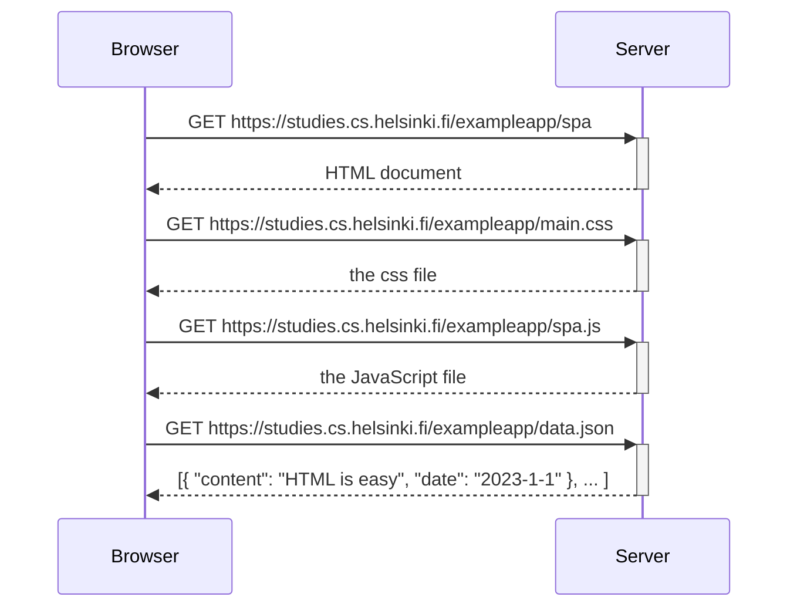

```mermaid
  sequenceDiagram
    Browser->>+Server: GET https://studies.cs.helsinki.fi/exampleapp/spa
    Server-->>-Browser: HTML document

    Browser->>+Server: GET https://studies.cs.helsinki.fi/exampleapp/main.css
    Server-->>-Browser: the css file

    Browser->>+Server: GET https://studies.cs.helsinki.fi/exampleapp/spa.js
    Server-->>-Browser: the JavaScript file

    Browser->>+Server: GET https://studies.cs.helsinki.fi/exampleapp/data.json
    Server-->>-Browser: [{ "content": "HTML is easy", "date": "2023-1-1" }, ... ]
```